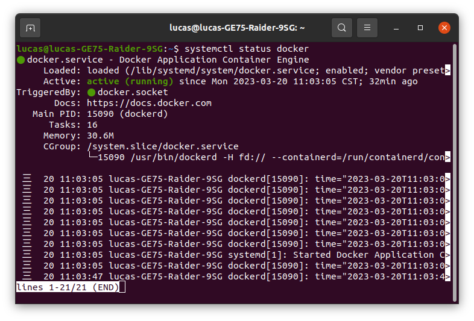
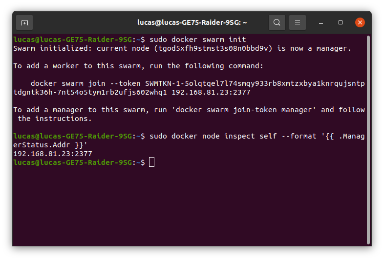
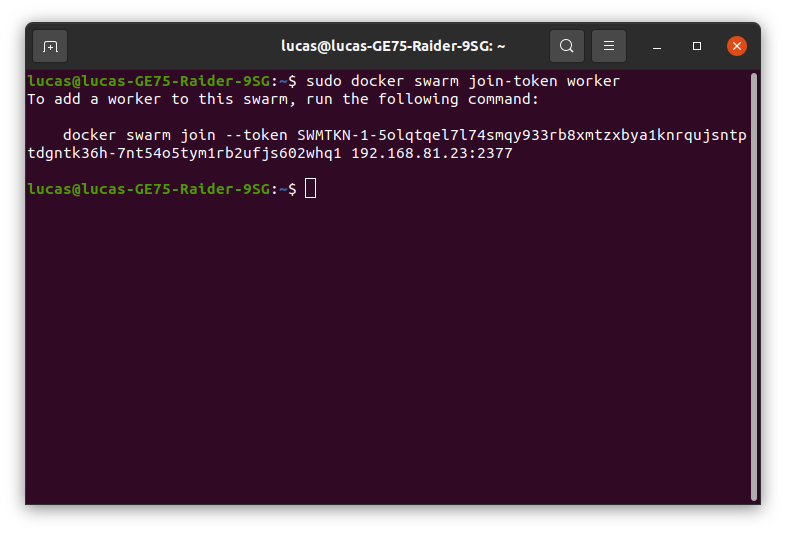
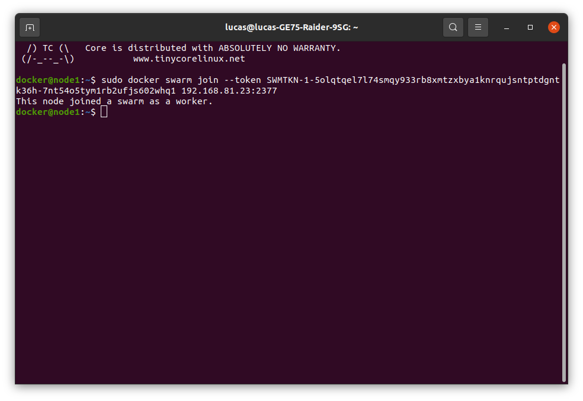
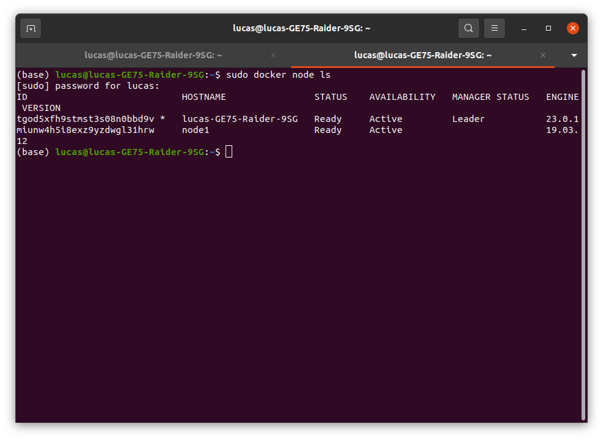
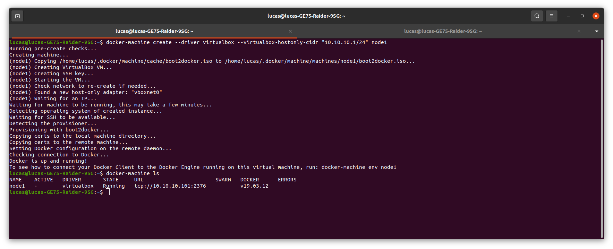
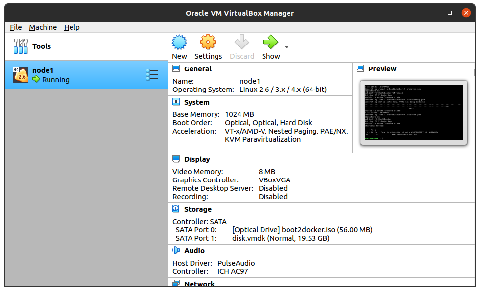

### Complete the setup of a swarm mode cluster, with managers and worker nodes (完成 Swarm 模式集群的設置，包括管理節點和工作節點)

**Swarm 是 Docker 提供的一種容器集群管理解決方案，可以將多個 Docker 主機聯合起來形成一個大型的虛擬集群，使得用戶可以更加方便地管理和運行多個容器應用。在 Swarm 中，集群由多個節點組成，這些節點可以分為管理節點和工作節點。**

完成 Swarm 模式集群的設置，需要以下步驟：

1. 準備 Docker 環境：在所有節點上安裝 Docker Engine。
    要查看 Docker Engine 的狀態，您可以使用以下命令：
    ```
    $ systemctl status docker：該命令將顯示 Docker 服務的狀態，包括運行狀態、PID 等信息。
    $ docker info：            該命令將顯示有關 Docker 引擎的詳細信息，例如 Docker 版本、容器數量、映像數量等。
    $ docker ps：              該命令將列出當前正在運行的 Docker 容器。
    $ docker version：         該命令將顯示有關 Docker 版本的詳細信息，例如版本號、API 版本等。
    ```
    這些命令將幫助您了解 Docker 引擎的狀態以及正在運行的容器和映像的數量等重要信息。

***
2. 初始化 Swarm：在管理節點上運行“docker swarm init”命令來初始化 Swarm。

    ```
    $ sudo docker swarm init
    ```
    這段命令的作用是在 Docker 上建立一個 Swarm 集群，並將當前節點初始化為管理節點。
    &nbsp;
    首先，您需要在 Docker 主機上運行 'sudo docker swarm init' 命令。這將初始化一個新的 Swarm 集群，並將當前節點設置為 Swarm 集群的管理節點。並顯示 Swarm Manager 節點的 IP 地址和端口號（在這個示例中為 192.168.81.23:2377）。
    &nbsp;
    接下來，您可以使用 'sudo docker node inspect self --format "{{ .ManagerStatus.Addr }}"' 命令查看當前節點的 Swarm Manager 狀態。該命令將輸出當前節點的 IP 地址和端口號，以及當前節點的 Swarm Manager 狀態。
    ```
    sudo docker node inspect self --format "{{ .ManagerStatus.Addr }}"
    ```
    &nbsp;
    在這個示例中，輸出顯示當前節點的 Swarm Manager 狀態是 192.168.81.23:2377。
***

3. 加入工作節點：在工作節點上運行“docker swarm join”命令並提供管理節點的 IP 地址和端口號，以加入到 Swarm 中。
&nbsp;
如果您忘記了 'docker swarm init' 命令生成的令牌，可以在 Swarm 管理節點上使用以下命令
    ```
    docker swarm join-token worker
    ```
    
    接下來轉移到要加入到 Swarm 集群中的節點，在該節點上運行此命令
    ```
    sudo docker swarm join --token SWMTKN-1-5olqtqel7l74smqy933rb8xmtzxbya1knrqujsntptdgntk36h-7nt54o5tym1rb2ufjs602whq1 192.168.81.23:2377
    ```


    &nbsp;
    該命令中的 'SWMTKN-1-5olqtqel7l74smqy933rb8xmtzxbya1knrqujsntptdgntk36h-7nt54o5tym1rb2ufjs602whq1' 是令牌，用於在工作節點上驗證和註冊到 Swarm 集群。192.168.81.23:2377 是 Swarm 集群的管理節點的 IP 地址和端口號。
    &nbsp;
    運行此命令後，工作節點將註冊到 Swarm 集群中，並開始參與集群的工作。您可以使用 'docker node ls' 命令查看集群中的所有節點，確認新的工作節點是否已成功加入到集群中。
    &nbsp;
    這邊使用docker-machine 和 virtualbox創建虛擬節點 **node1**，將node1加入Swarm 集群中
    
***
4. 確認節點的加入狀態：在管理節點上運行“docker node ls”命令，確認所有節點都已成功加入到 Swarm 中。
    ```
    sudo docker node ls
    ```
    

5. 部署服務：在 Swarm 集群中運行容器時，需要使用服務來管理和調度容器。可以使用“docker service create”命令來創建一個服務，並指定要運行的容器映像檔、執行數量、網絡配置、端口映射等選項。
    
    > 在 Docker Swarm 集群中，服務（Service）是管理和調度容器的基本單位，可以通過創建服務來運行容器。服務可以指定要運行的容器映像檔、執行數量、網絡配置、端口映射等選項，並由 Swarm 集群負責在不同的節點上分配和調度這些容器。

    以下是使用“docker service create”命令創建一個服務的詳細說明和範例：

    語法：
    ```
    docker service create [OPTIONS] IMAGE [COMMAND] [ARG...]
    ```
    OPTIONS:

    | OPTIONS | 說明     | 
    | -------- | -------- | 
    | --name | 指定服務名稱 | 
    | --replicas | 指定容器副本數量 | 
    | --network | 指定網絡 | 
    | --publish | 指定端口映射 | 
    | --constraint | 指定節點條件 | 
    | --mount | 指定掛載卷 | 

    範例：

    在 Swarm 集群中運行一個 nginx 服務，指定執行 3 個容器，映像檔為 nginx:latest，使用默認網絡和端口映射：
    > Nginx 是一種高性能的 Web 伺服器軟體，也可以用作反向代理、負載均衡器和 HTTP 緩存等。它使用事件驅動的架構和非阻塞 I/O 模型，可以處理大量的並發請求，同時具有低內存使用和高效的網路處理能力。
    Nginx 最初是由俄羅斯的 Igor Sysoev 開發的，並於2004年首次公開發佈。現在，Nginx 已成為一個非常流行的 Web 伺服器軟體，在全球許多網站和應用中得到廣泛使用。
    在 Docker 中，可以使用 Nginx 映像檔來運行 Nginx 服務，並通過 Swarm 集群來管理和調度容器。通過使用 Nginx 服務，可以輕鬆地在不同的容器之間進行負載均衡、反向代理和緩存等操作，同時保證高可用性和高效性能。

    > 負載均衡和反向代理都是在分佈式系統中常用的概念，用於改善系統的性能和可靠性。
    負載均衡（Load Balancing）指的是將請求平均分配到多個伺服器或處理器上，從而實現系統的高可用性和高性能。負載均衡器通常位於系統的前端，接收所有請求，並將它們分發到不同的伺服器上進行處理。這樣可以減少單個伺服器的負載，提高系統的處理能力和容錯性。
    反向代理（Reverse Proxy）則是一個位於伺服器端的中間件，用於將外部請求轉發到內部伺服器上進行處理。反向代理通常位於系統的後端，用於保護伺服器和應用，隱藏內部網路結構，同時提供負載均衡、緩存、加密等功能。反向代理可以提高系統的安全性和可靠性，同時也可以提高系統的性能。
    在分佈式系統中，通常需要使用負載均衡和反向代理來實現高可用性、高性能和安全性。例如，在 Web 應用中，可以使用負載均衡器來分配請求到不同的 Web 伺服器上進行處理，同時使用反向代理來保護伺服器和應用，提高系統的可靠性和安全性。
    ```
    docker service create --name my-nginx --replicas 3 nginx:latest
    ```
    ```
    $ docker service ps <SERVICE_NAME> 命令，其中 <SERVICE_NAME> 為要查詢的服務名稱。 執行結果將會列出所有<SERVICE_NAME> 服務的容器運行狀態，包括容器 ID、節點名稱、狀態等信息

    $ docker service ls 命令，查詢要服務名稱和 ID
    ```
    


***

6. 管理集群：可以使用“docker node”和“docker service”命令來管理 Swarm 集群中的節點和服務，例如增加或減少服務的副本數量、更改服務的配置等。


總之，完成 Swarm 模式集群的設置，需要對所有節點進行適當的準備和配置，確保所有節點都能順利加入到集群中，並使用適當的命令來管理和調度容器。


## Docker Machine 工具
在 Ubuntu 20.04 上安裝 Docker Machine 工具，您可以按照以下步驟進行：
1. 在終端中執行以下命令，以下載 Docker Machine 二進制文件：

    ```
    sudo curl -L "https://github.com/docker/machine/releases/download/v0.16.2/docker-machine-`uname -s`-`uname -m`" -o /usr/local/bin/docker-machine
    ```
    這會將 Docker Machine 二進制文件下載到 '/usr/local/bin' 目錄中。
    &nbsp;

2. 授予二進制文件可執行權限：
    ```
    sudo chmod +x /usr/local/bin/docker-machine
    ```
3. 驗證 Docker Machine 是否安裝成功：

    ```
    docker-machine version
    ```
    如果您能夠看到版本信息，則表明 Docker Machine 安裝成功。
    
現在，您可以使用 Docker Machine 工具來創建和管理多個虛擬機，並在其中運行 Docker 容器。請注意，在安裝 Docker Machine 工具之前，您需要先安裝 Docker 引擎。

```
docker-machine create --driver virtualbox --virtualbox-hostonly-cidr "10.10.10.1/24" node1
```
這是一個使用 Docker Machine 創建虛擬機器的命令，該虛擬機器使用 VirtualBox 驅動程序，在 VirtualBox 中創建了一個名為 node1 的虛擬機器。

參數說明如下：

--driver virtualbox：指定使用 VirtualBox 驅動程序來創建虛擬機器。

--virtualbox-hostonly-cidr "10.10.10.1/24"：指定在 VirtualBox 中創建虛擬機器時，使用的主機專用網路的 IP 範圍。在這個範例中，主機專用網路的 IP 範圍是 10.10.10.1/24，這表示子網掩碼是 255.255.255.0，IP 範圍是 10.10.10.1 到 10.10.10.254。

node1：指定虛擬機器的名稱為 node1。

總的來說，這個命令會在 VirtualBox 中創建一個名為 node1 的虛擬機器，該虛擬機器使用主機專用網路 10.10.10.1/24，可以用來運行 Docker 容器。您可以使用 docker-machine ssh node1 命令登錄到虛擬機器中，然後使用 Docker 命令運行容器。


接下來連接到虛擬機器的終端介面，並讓您在其中運行指令。
```
docker-machine ssh node1
```

其他常用
```
docker-machine stop node1
docker-machine start node1
docker-machine regenerate-certs node1
```
停止/啟動虛擬機
重新生成 TLS 憑證
完成後，您可以執行 docker-machine ls 指令，確認 node1 虛擬機現在的狀態是 Running。
***

## VirtualBox 
您可以按照以下步驟在 Ubuntu 20.04 上安裝 VirtualBox：

```
$sudo apt update
$sudo apt install virtualbox
$virtualbox
```

在 VirtualBox 中，/etc/vbox/networks.conf 是用來設定 NAT 網路範圍的配置檔案。NAT 網路是 VirtualBox 提供的一種網路設置，它允許虛擬機器共享主機的 IP 地址，並使用 NAT (Network Address Translation) 技術將主機的網路流量轉發給虛擬機器。
```
sudo vim /etc/vbox/networks.conf
* 192.168.56.0/21
* 10.10.10.1/24
```
**'10.10.10.1/24'** 的意思是使用 24 個二進制位（或者說是 255.255.255.0 的子網掩碼）來表示網路地址。在這個子網中，第 1 至第 3 個數字（10.10.10）表示網路地址，而最後一個數字則是主機地址。

由於使用了 24 個二進制位，因此可以表示 $2^{8}-2=254$ 個主機地址（其中減去了網路地址和廣播地址）。因此，10.10.10.1/24 的範圍是 10.10.10.1 到 10.10.10.254。
***